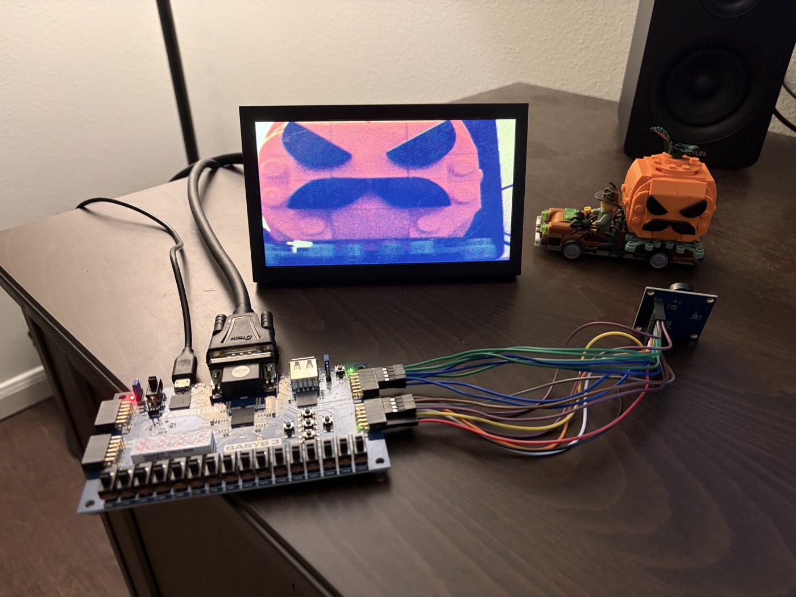
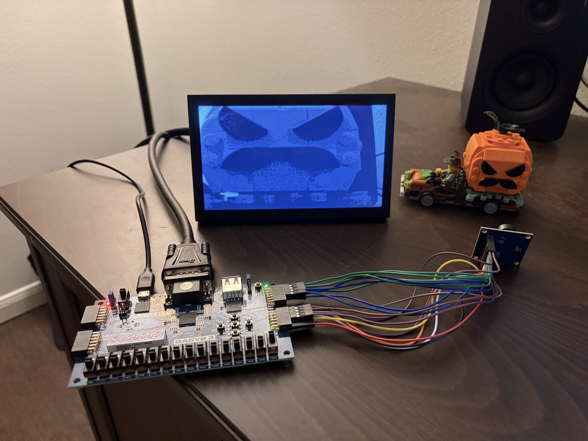
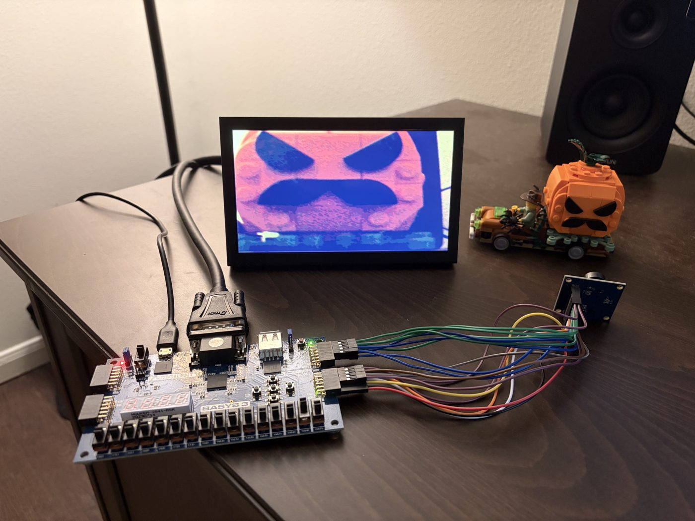
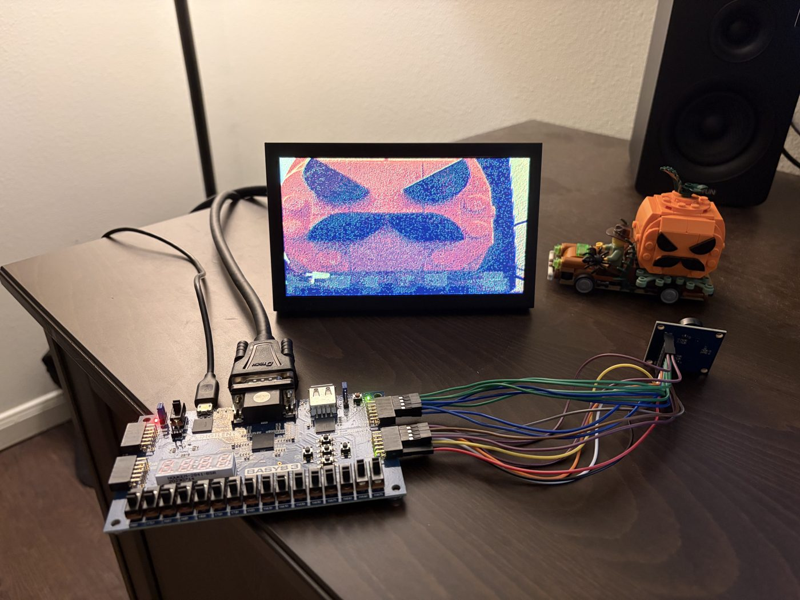
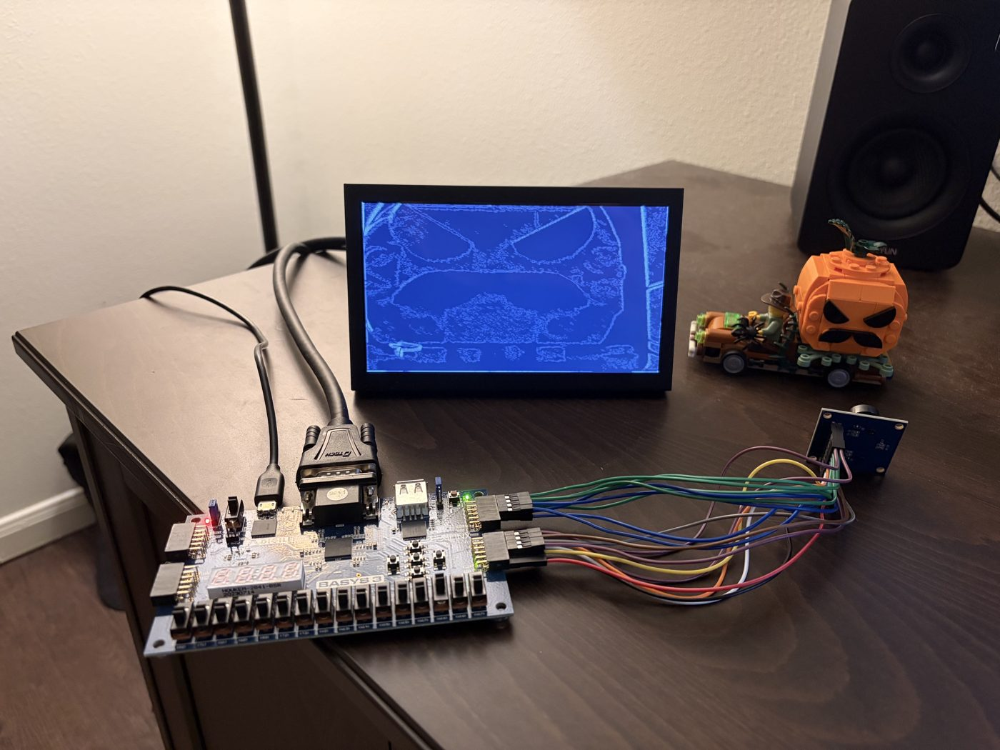
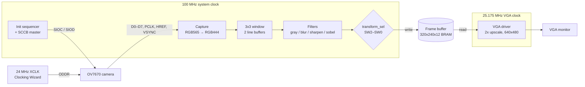

# ov7670_to_vga

Real-time camera-to-VGA video pipeline on a Basys3 FPGA, with selectable 3x3 image filters, written in SystemVerilog.

<table>
  <tr>
    <td align="center"><br><code>000</code> Passthrough</td>
    <td align="center"><br><code>001</code> Grayscale</td>
    <td align="center"><br><code>010</code> Gaussian blur</td>
  </tr>
  <tr>
    <td align="center"><br><code>011</code> Sharpen</td>
    <td align="center"><br><code>100</code> Sobel edges</td>
    <td></td>
  </tr>
</table>

## Features

- Captures 320x240 RGB565 video from an OV7670 camera module
- 3x3 filters selectable with the board switches: grayscale, Gaussian blur, sharpen, and Sobel edge detection
- Streams one pixel per clock through the filter pipeline, with no CPU or vendor video IP
- 640x480 @ 60 Hz VGA output (each camera pixel shown as a 2x2 block)
- Camera configured on startup through a custom SCCB (I2C-like) bus master

## Architecture



The camera sends each pixel as two bytes over an 8-bit bus. The capture block samples the bus in the 100 MHz system domain, joins the two bytes into an RGB565 pixel, tags it with its x/y position, and cuts it down to 12-bit RGB444. The pixel then enters a 3x3 sliding window built from two line buffers. All four filters run on every window in parallel, and the slide switches pick which result goes on. That result is written into a 320x240 frame buffer in block RAM. The VGA driver reads the buffer back on the 25.175 MHz pixel clock, showing each stored pixel as a 2x2 block to fill 640x480.

## Results

| Metric | Value |
|---|---|
| Target | Artix-7 XC7A35T (Digilent Basys3) |
| Timing | Met at 100 MHz, WNS +1.05 ns |
| LUTs / registers | 575 / 404 |
| Block RAM | 37.5 / 50 tiles (75%) |
| DSPs | 0 |
| Filter pipeline latency | 1 line + 2 pixels |
| Resolution | 320x240 source, 2x upscaled to 640x480 @ 60 Hz |

<!-- TODO: add the camera frame rate once measured on hardware. -->

## Design highlights

### Clock domains

All three clocks come from the 100 MHz oscillator. The system logic runs at 100 MHz, one Clocking Wizard makes the 24 MHz camera XCLK (sent out through an ODDR), and another makes the 25.175 MHz VGA pixel clock. The camera's 12 MHz PCLK is not used as a clock. The 100 MHz system clock samples PCLK, HREF and VSYNC through two-flop synchronisers and detects their edges, so the whole capture and filter path is in one clock domain. The dual-clock frame buffer is the only place data crosses between clocks. Each domain also has its own synchronised reset, held until its clock wizard reports lock.

### Streaming 3x3 convolution

Two line buffers hold the previous two image rows, and three 3-tap shift registers turn those rows plus the incoming one into a 3x3 window. The window moves one pixel for every camera pixel, so every filter handles one pixel per clock and nothing needs a full frame stored. Each pixel's x/y coordinates travel through their own copy of the same line buffer and shift register, so they stay matched to the window centre by construction instead of by counting delays by hand. The output stays invalid until the pipeline has filled (one line plus two pixels).

### Timing closure

The first build failed timing at 100 MHz with WNS -2.91 ns. The critical path ran through the Sobel filter: 14 logic levels of luminance, gradient and magnitude arithmetic feeding straight into the frame buffer write. Adding a register inside the Sobel filter and another in front of the frame buffer fixed it. The other filters, the coordinates and the valid signal are delayed one cycle to match the Sobel stage. The current build meets timing with WNS +1.05 ns.

### Tradeoffs

- **Single frame buffer.** A 320x240 frame at 12 bits already uses 37.5 of the 50 block RAM tiles, so double buffering does not fit. The camera writes and the VGA reads the same buffer, and fast motion can tear.
- **12-bit colour.** The pixels are cut down to RGB444 before filtering because the Basys3 VGA DAC only has 4 bits per channel. This also makes the line buffers and frame buffer smaller.
- **Sobel magnitude as |gx| + |gy|.** This avoids a square root and multipliers. It is close enough for edge display and uses no DSP slices.

## Modules

| Module | Description |
|---|---|
| `ov7670_to_vga` | Top level: clocking, frame buffer, and wiring between the camera, filters, and VGA |
| `ov7670_driver` | Camera control: XCLK generation, register init, and pixel capture |
| `ov7670_init_sequencer` | Holds the camera in reset, then writes the register table from `ov7670_init.mem` |
| `sccb_master` | Write-only SCCB bus master for camera configuration |
| `ov7670_capture` | Turns the camera byte stream into RGB565 pixels with x/y coordinates |
| `image_transform` | Builds the 3x3 window and selects the active filter |
| `line_buffer` | Delays the pixel stream by one line |
| `window_register` | Shift register holding one row of the window |
| `grayscale_transform` | Luminance approximation |
| `blur_transform` | 3x3 Gaussian blur |
| `sharpen_transform` | 3x3 sharpen with clamping |
| `sobel_transform` | Sobel edge magnitude on luminance |
| `vga_driver` | 640x480 @ 60 Hz sync and pixel timing |

## Hardware setup

**Parts**

- Digilent Basys3 (Artix-7 XC7A35T)
- OV7670 camera module (version without the FIFO)
- VGA monitor and cable

**Connections**

The camera's control and sync signals go to Pmod JC and its data bus goes to Pmod JB. Power the camera from the Pmod 3.3V and GND pins (pins 6 and 5). The VGA monitor plugs into the Basys3's onboard VGA port.

| Pmod JC | OV7670 | Pmod JB | OV7670 |
|---|---|---|---|
| JC1 | PWDN | JB1 | D0 |
| JC2 | XCLK | JB2 | D2 |
| JC3 | HREF | JB3 | D4 |
| JC4 | SIOD (SDA) | JB4 | D6 |
| JC7 | RESET | JB7 | D1 |
| JC8 | PCLK | JB8 | D3 |
| JC9 | VSYNC | JB9 | D5 |
| JC10 | SIOC (SCL) | JB10 | D7 |

The FPGA package pins are in [`constraints/basys3.xdc`](constraints/basys3.xdc). SIOD gets an internal pull-up there, so it works whether or not the camera breakout has its own.

**Controls**

| Input | Function |
|---|---|
| BTNC | Reset |
| LD0 | Lit when camera initialisation is done |
| SW2 SW1 SW0 = `000` | Passthrough |
| `001` | Grayscale |
| `010` | Gaussian blur |
| `011` | Sharpen |
| `100` | Sobel edge detection |

## Building

Requires Vivado 2024.2.

From the repo root, recreate the Vivado project in `build/`:

```
vivado -mode batch -source scripts/create_project.tcl
```

Then open `build/ov7670_to_vga.xpr` and run Generate Bitstream.

## Repository layout

```
rtl/          SystemVerilog sources and the camera register table (ov7670_init.mem)
constraints/  Basys3 pin and timing constraints
ip/           Clocking Wizard IP configurations (.xci)
scripts/      Project creation script
docs/         README images
```

## Limitations and future work

- No border handling: the 3x3 window wraps across line and frame edges
- Single frame buffer, so tearing is visible on fast motion
- No simulation testbench yet
